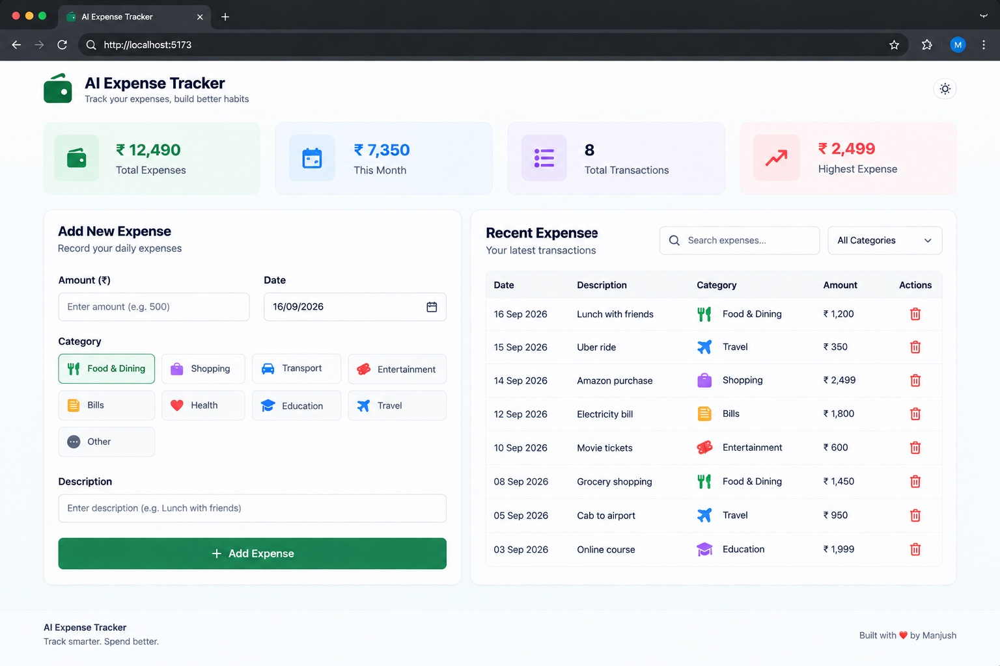

# AI Expense Tracker

A full-stack expense tracking application built with **Spring Boot, React, and PostgreSQL**. The application allows users to record daily expenses and manage their spending information through a simple web interface.

## 📸 Dashboard



## 🚀 Features

- Add daily expenses
- View recorded expenses
- Delete expenses
- Track expense amount, category, date, and description
- RESTful backend API
- React-based frontend
- PostgreSQL database for persistent storage
- Layered Spring Boot architecture
- Responsive and simple user interface

## 🛠️ Tech Stack

### Backend
- Java
- Spring Boot
- Spring Web
- Spring Data JPA
- Hibernate
- Maven

### Frontend
- React
- Vite
- JavaScript
- HTML
- CSS
- Axios

### Database
- PostgreSQL

### Tools
- Git
- GitHub
- Postman
- Docker

## 🏗️ Architecture

```text
┌──────────────────────┐
│      User            │
└──────────┬───────────┘
           │
           ▼
┌──────────────────────┐
│   React Frontend     │
│   Vite + Axios       │
└──────────┬───────────┘
           │ HTTP / REST API
           ▼
┌──────────────────────┐
│   Spring Boot API    │
│                      │
│ Controller           │
│ Service              │
│ Repository           │
└──────────┬───────────┘
           │
           ▼
┌──────────────────────┐
│     PostgreSQL       │
│      Database        │
└──────────────────────┘
```

## 🔄 Application Flow

```text
User enters expense details
          ↓
React Frontend
          ↓
Axios HTTP Request
          ↓
Spring Boot REST Controller
          ↓
Expense Service
          ↓
Expense Repository
          ↓
PostgreSQL
          ↓
Saved Expense
          ↓
Updated Expense List
```

## 📂 Project Structure

```text
ai-expense-tracker/
│
├── frontend/
│   ├── public/
│   ├── src/
│   ├── package.json
│   └── vite.config.js
│
├── src/
│   ├── main/
│   │   └── java/
│   │       └── com/
│   │           └── manjush/
│   │               └── expensetracker/
│   │                   ├── expense/
│   │                   │   ├── Expense.java
│   │                   │   ├── ExpenseController.java
│   │                   │   ├── ExpenseService.java
│   │                   │   ├── ExpenseRepository.java
│   │                   │   └── ...
│   │                   └── config/
│   │
│   └── test/
│
├── docs/
│   └── screenshots/
│       └── dashboard.jpeg
│
├── pom.xml
├── mvnw
├── mvnw.cmd
└── README.md
```

## 🔌 API

The backend exposes REST endpoints for managing expenses.

| Method | Endpoint | Description |
|--------|----------|-------------|
| GET | `/api/expenses` | Retrieve expenses |
| POST | `/api/expenses` | Add a new expense |
| DELETE | `/api/expenses/{id}` | Delete an expense |

> API paths may vary depending on the current backend configuration.

## 🗄️ Database

The application uses **PostgreSQL** to persist expense records.

An expense contains information such as:

- Amount
- Category
- Date
- Description

Spring Data JPA and Hibernate are used for database interaction and object-relational mapping.

## ⚙️ Getting Started

### Prerequisites

Make sure the following are installed:

- Java 21+
- Maven
- Node.js
- npm
- PostgreSQL
- Git

### 1. Clone the repository

```bash
git clone https://github.com/manjush007/ai-expense-tracker.git
cd ai-expense-tracker
```

### 2. Configure PostgreSQL

Create a PostgreSQL database and configure the database connection in the Spring Boot application.

Example:

```text
Database: expense_tracker
Username: expense_user
Password: expense_password
Port: 5432
```

### 3. Run the backend

```bash
./mvnw spring-boot:run
```

The backend runs on:

```text
http://localhost:8080
```

### 4. Run the frontend

Open another terminal:

```bash
cd frontend
npm install
npm run dev
```

The frontend will be available through the Vite development server.

## 🧪 Testing

The backend includes Spring Boot test configuration for verifying application context loading.

Run tests with:

```bash
./mvnw test
```

## 🔮 Future Improvements

- Expense analytics and charts
- Monthly and category-based spending insights
- Budget tracking
- Authentication and user accounts
- AI-powered spending insights
- Automated expense categorization
- Deployment with production database

## 👨‍💻 Author

**Manjush Premkumar**

B.Tech Computer Science Engineering

GitHub: [@manjush007](https://github.com/manjush007)

---

⭐ If you find this project useful, feel free to explore the repository.
